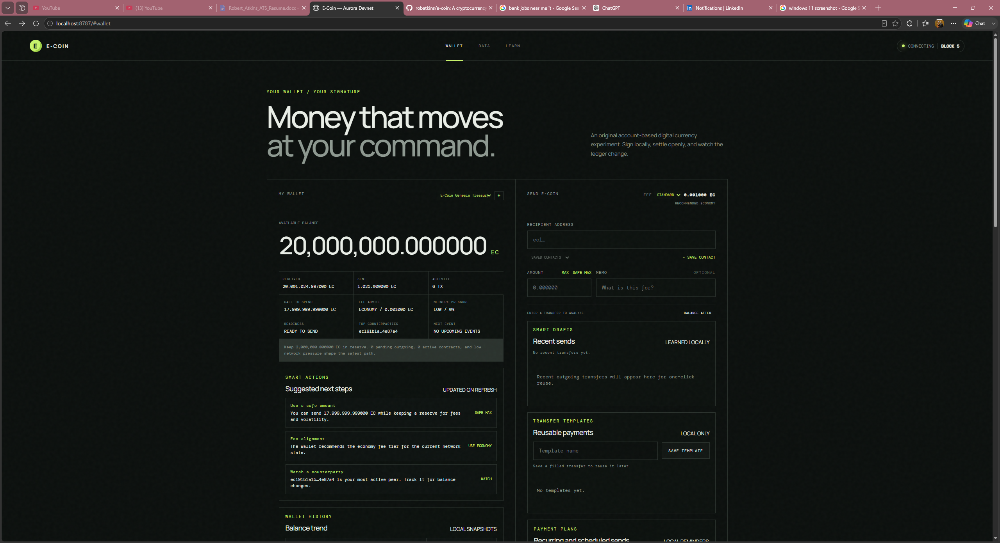
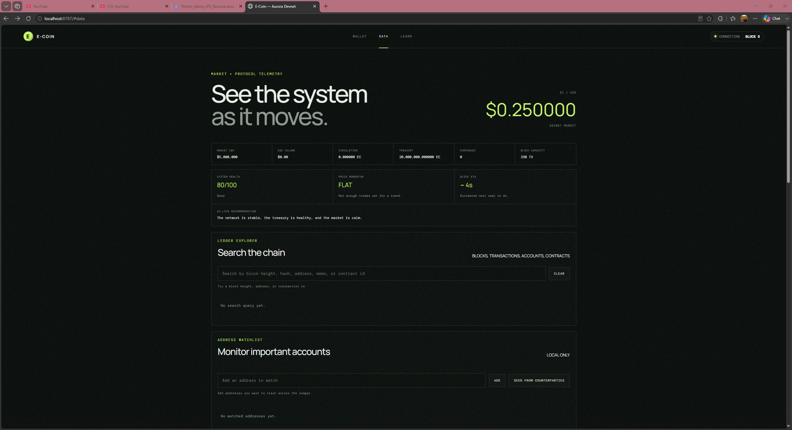
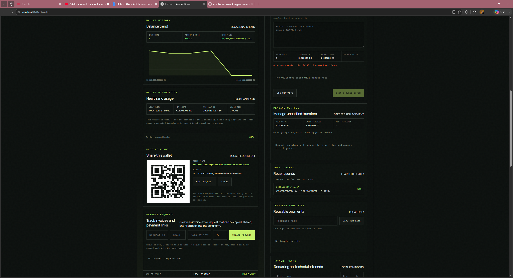
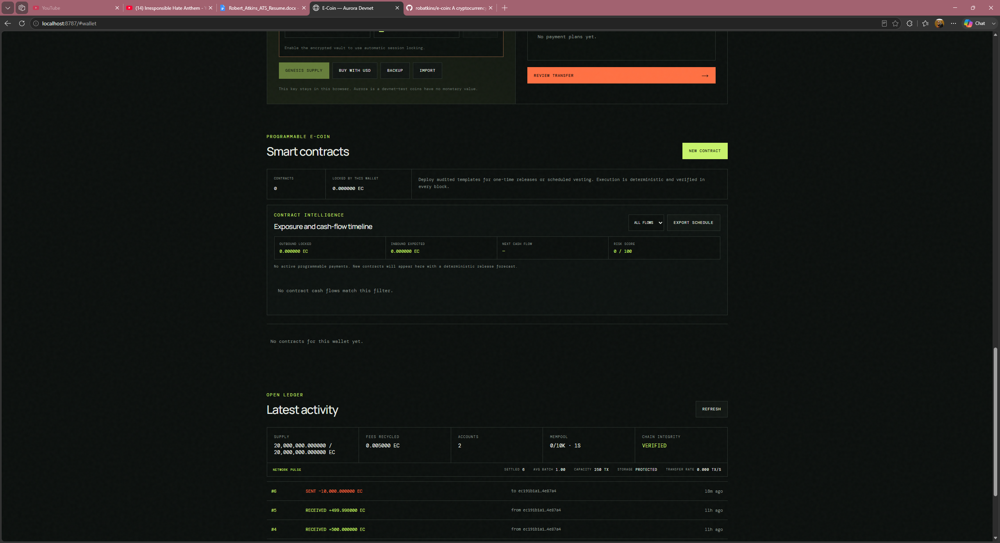

# E-Coin

E-Coin is an original, account-based cryptocurrency devnet with a browser wallet, smart contracts, an internal USD market, and agentic wallet intelligence. It is not Bitcoin and does not reuse Bitcoin's code, transaction model, address format, mining, or protocol.

E-Coin is currently a single-node **Aurora Devnet** sandbox. Test coins have no real monetary value, the internal USD market does not charge real USD, and this project is not production financial infrastructure.

## Screenshots








## What It Includes

### Protocol And Ledger

- Fixed 20,000,000 EC genesis supply held by the local Genesis Treasury wallet.
- Account-based `ec1...` addresses backed by Ed25519 wallet identities.
- Integer micro-coin accounting where `1 EC = 1,000,000 uEC`.
- Signed transfers with sequential nonces, deterministic state roots, and hash-linked blocks.
- Six-second block production with nonce-ordered, fee-prioritized transaction batches.
- Adaptive 250-2,000 transaction block capacity with per-sender fairness limits.
- Bounded 10,000-entry mempool with ten-minute expiry and restart revalidation.
- Safe replace-by-fee with payment-intent preservation.
- Versioned SHA-256-checksummed ledger snapshots with fail-closed recovery.
- Replay-based integrity checks for balances, nonces, signatures, fees, and state roots.
- Ledger explorer search across blocks, transactions, accounts, and contracts.

### Wallet

- Browser-local, non-custodial wallet with encrypted multi-wallet vault support.
- Multi-wallet creation, naming, switching, import, export, and per-wallet backup.
- Nested subwallets with visible parent/child lineage and branch analytics.
- Safe-spend guidance, fee recommendations, wallet diagnostics, and activity intelligence.
- Address book, reusable transfer templates, recent outgoing payments, and payment requests.
- Batch transfer composer with atomic queueing.
- Offline transfer draft/export/sign/broadcast flow.
- Settlement receipts with independent receipt verification.
- Transaction Guard policies for daily limits, reserves, and known-contact checks.
- Security Center with recovery state, session locking, local security journal, and recommendations.

### Smart Contracts

- Signed deterministic contract deployments through the mempool.
- Separate committed contract-state roots in every block.
- Time-lock contracts with automatic beneficiary release after unlock.
- Scheduled vesting contracts with 2-52 deterministic installments.
- Milestone contracts with approval-aware release simulation.
- Hash-locked escrow with public preimage claims and expiry refunds.
- Contract portfolio, cash-flow timeline, schedule metrics, and draft simulation.
- Contract safety limits for active counts, schedules, and execution batches.

### Market And Data

- Treasury-backed internal USD quotes and idempotent devnet purchases.
- Faucet distributions and market buys move existing treasury coins instead of minting.
- Protocol fees recycle into the Genesis Treasury.
- Signed internal order book with limit buy/sell orders, partial fills, open orders, and trade tape.
- Data dashboard with price, market cap, volume, treasury, liquidity, and network charts.
- Market alerts, price history, load chart, market tape, and order-book assistant.
- Data-tab health scoring, price momentum, execution lens, anomaly review, and signal control.

### Agentic Intelligence

- Data Copilot that synthesizes wallet, market, counterparty, protocol, and signal state into a next-step plan.
- Copilot confidence, recommendation shift, dominant driver, next-turn forecast, flip risk, and watchpoint.
- Per-wallet Copilot decision journal and feedback loop.
- Agent Workbench with ranked operating playbooks and one-click navigation to the relevant app surface.
- Objective steering for Safety, Execution, Liquidity, and Growth.
- Rehearsal layer that previews likely outcome, blockers, autonomy level, and next checkpoint.
- Per-wallet task memory that marks opened playbook items as reviewed and re-ranks follow-up work.
- Browser-local signal feed with auto-tuning, retained evidence, watchlist deltas, and counterparty posture.

### Learn

- Learn tab with protocol overview, supply model, market explanation, smart contract guidance, and safety basics.
- Legal and regulatory education covering money transmission, AML/KYC, sanctions, consumer protection, and tax caveats.
- Information-security guidance for passwords, recovery material, phishing, urgent requests, and address verification.
- Knowledge quiz and local progress tracking.

## Run

Requires Node.js 20 or newer. There are no third-party runtime dependencies.

```powershell
npm start
```

Open [http://localhost:8787](http://localhost:8787).

For development with Node's watch mode:

```powershell
npm run dev
```

Run the test suite:

```powershell
npm test
```

## Project Layout

- `src/ledger.mjs` - ledger, mempool, market, treasury, contracts, snapshots, and protocol rules.
- `src/server.mjs` - local HTTP API, static app serving, event stream, and treasury bootstrap.
- `public/` - browser wallet, Data page, Learn tab, styles, and local wallet intelligence modules.
- `test/` - protocol, contract, mempool, recovery, vault, receipt, and wallet-flow tests.
- `data/` - local devnet ledger snapshot storage.

## Current Status

The current build is protocol 8. It is deliberately a local single-node devnet for experimentation, education, and wallet UX iteration. Do not attach real monetary value to E-Coin devnet balances, internal USD quotes, or simulated market activity.

Useful next directions include peer synchronization, validator identities, proof-of-stake or BFT-style consensus, richer smart-contract tooling, stronger UI test coverage, and production-grade threat modeling.
